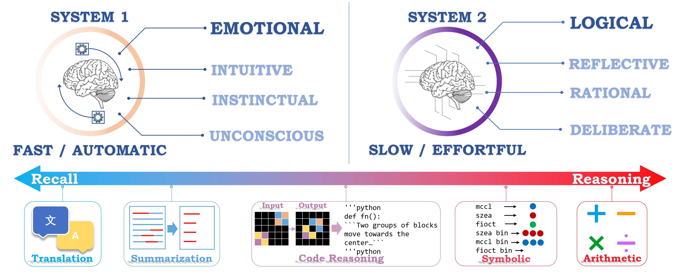
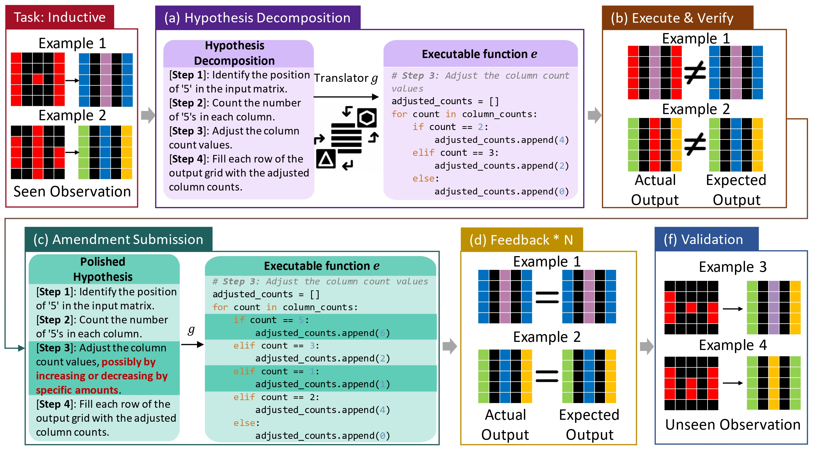
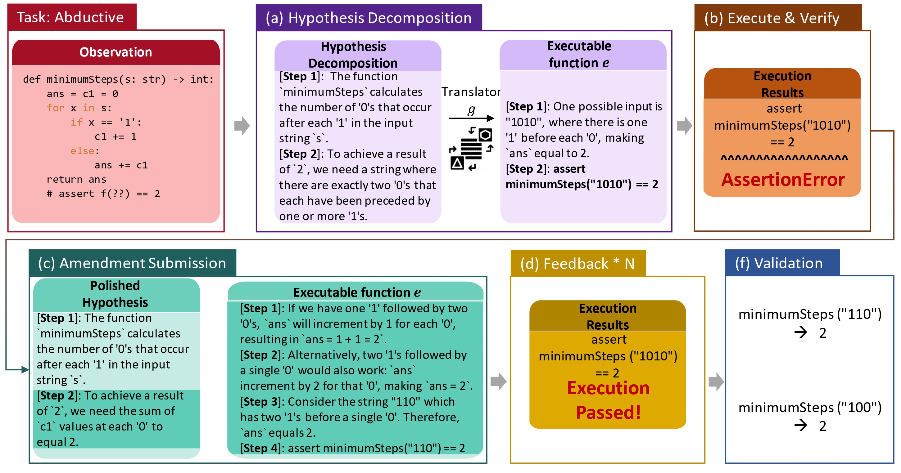

# Code Reasoning through Hypothesis Decomposition and Amendment

This repository contains code for the paper "Unveiling the Magic of Code Reasoning through Hypothesis Decomposition and Amendment"



## Code Reasoning
Code reasoning is a category of tasks that incorporates logical reasoning into code, aiming to solve programming problems through logical reasoning.
### Inductive Code Reasoning
Inductive code reasoning is concretized as a Programming by Example task, including four tasks: List Function, MiniARC, RubostFill and Deepcoder
### Deductive Code Reasoning
Deductive code reasoning can be instantiated as an output prediction task, including two tasks: CRUXEval-O and LiveCodeBench-O.
### Abductive Code Reasoning
Abductive code reasoning is formulated as an input prediction task, including two tasks: CRUXEval-I and LiveCodeBench-I.

## Method: Reflective Hypothesis Decomposition and Amendment
Reflective Hypothesis Decomposition and Amendment (RHDA) is a novel framework that leverages iterative hypothesis refinement to decompose the reasoning process into a sequence of hypotheses and amend the hypotheses through tool-augment refinement. RHDA is a general framework that can be applied to various code reasoning tasks.

### RHDA on Inductive Code Reasoning


### RHDA on Deductive Code Reasoning


### RHDA on Abductive Code Reasoning


## Setup

1. Set up the OpenAI API key and Anthropic API key. Store them in the environment variables `OPENAI_API_KEY` and `ANTHROPIC_API_KEY`.
2. Install the dependencies using 

```bash
pip install -r requirements.txt
```

## Code Structure
- `data`: Data used in our paper.
- `prompts`: Prompt templates for each task.
- `tasks`: Task-specific code.
- `results`: Outputs and model interactions for each task. The naming convention follows `{model}_{task}` (see below). The default setting is used if a value is not specified.
- `scripts`: Useful scripts.
- `run_task.py`: Main script to run experiments.

## Run Experiments

To rerun our experiments, you'll need access to the relevant APIs. You can also convert our provided output files into a cache file. Our query function will automatically use the cache content without making API calls. You should be able to roughly reproduce all of our experiments this way, except for some experiments where the translated Python programs introduce some randomness. To convert outputs to a cache file, run:

```bash
python scripts/convert_outputs_to_cache.py \
    --output_dir results \
    --cache_file results/query_cache.pkl
```

All experiments can be run using python run_task.py. You may need to specify the following key arguments:

- `--data_file`: Path to the data JSONL file. The data used in our paper is in `data` directory.
- `--model_name`: Model name, choices=([`gpt-4-0613, gpt-3.5-turbo-0613, claude-3-5-sonnet-20240620, gpt-4o-2024-08-06`]).
- `--task_name`: Task name, choices=([`list_function, arc, deepcoder, robustfill, cruxeval_input, cruxeval_output, livecodebench_input, livecodebench_output`]).
- `--mode`: response generate mode, choices=([`query, generate`]).
- `--output_file`: Path for the output JSON filed.
- `--method`: Method, choices=([`rule, io`]).
- `--max_iter`: Maximum number of iterations.
- `--temperature`: Sampling temperature.
- `--n`: Number of outputs per API call, i.e., the number of hypotheses per iteration for rule prompting and the number of predictions for SC prompting.
- `--rule_type`: Representation of hypothesis (see Section 3 of the paper).
- `--n_train`: Number of seen examples for each task.
- `--n_test`: Number of unseen examples for each task.
- `--cache_file`: Path to the cache file. It should be the same as the one used in `scripts/convert_outputs_to_cache.py`. Default to `${output_dir}/query_cache.pkl` if not specified.
- `--history_file`: Path to the history file that will be used to store the history of interactions with the model. Default to `${output_dir}/history.jsonl` if not specified.

To run experiments using reflective hypothesis decomposition and amendment:
```bash
python run_task.py --task_name ${task_name} \
    --data_file ${data_file} \
    --mode query \
    --model_name ${model_name} \
    --output_file ${output_file} \
    --cache_file ${cache_file} \
    --history_file ${history_file} \
    --max_iter ${iter} \
    --n_sample ${n} \
    --method rule \
    --rule_type ${rule_type} \
    --temperature ${t}
```

For example, to run the RHDA on the MiniARC task using the GPT-4o model with 2 iterations and 1 sample:
```bash
python run_task.py --task_name arc \
    --data_file ./data/inductive/miniarc.jsonl \
    --mode query \
    --model_name gpt-4o-2024-08-06 \
    --output_file results/gpt4o_arc_subgoal_refine/rule_nl_t2_n1_0.7 \
    --cache_file results/gpt4o_arc_subgoal_refine_0.7_cache \
    --history_file results/claude_deepcoder/gpt4o_arc_subgoal_refine_0.7_history \
    --max_iter 2 \
    --n_sample 1 \
    --method rule \
    --rule_type nl \
    --temperature 0.7
```

### RHDA on VirtualHome

